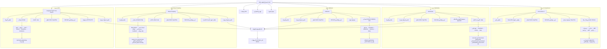

# المخطط الرئيسي — عربي

```mermaid
flowchart TD
  ROOT[استخراج أنظمة وكلاء LLM] --> AIS[AI Scientist v2]
  ROOT --> SR[Self-Refine]
  ROOT --> RX[Reflexion]
  ROOT --> MP[Meta-Prompting]
  ROOT --> LATS[Language Agent Tree Search]

  subgraph AIP[حزمة AI Scientist v2]
    AIS --> AI_SUM[ملخص بحثي]
    AIS --> AI_PROMPTS[كل البرومبتات والـ schemas]
    AIS --> AI_LOGIC[تحليل Python logic/flow]
    AIS --> AI_GRAPH[Mermaid عربي وإنجليزي]
    AIS --> AI_DEEP[مصفوفة مراحل Deep Dive]
    AIS --> AI_AUDIT[Gap audit وفحص شمولية]
    AI_PROMPTS --> AI_PHASES[أفكار → تجارب → رسومات → مراجع → كتابة → مراجعة]
    AI_PHASES --> AI_LOOPS[حلقات المراحل وBFTS والاستشهادات والانعكاس]
  end

  subgraph SRP[حزمة Self-Refine]
    SR --> SR_SUM[ملخص الورقة]
    SR --> SR_PROMPTS[ملفات البرومبت الخام]
    SR --> SR_LOGIC[تحليل Python logic/flow]
    SR --> SR_GRAPH[Mermaid عربي وإنجليزي]
    SR --> SR_DEEP[مصفوفة المهام وملاحظات appendix]
    SR --> SR_AUDIT[فحص شمولية وجودة]
    SR_PROMPTS --> SR_PHASES[توليد أولي → Feedback → Refine → Stop]
    SR_PHASES --> SR_TASKS[Acronym وCommonGen وGSM وPIE وResponseGen وSentiment وReadability وVisual GPT-4V]
  end

  subgraph RXP[حزمة Reflexion]
    RX --> RX_SUM[ملخص الورقة]
    RX --> RX_PROMPTS[مصادر prompts/config/few-shot]
    RX --> RX_LOGIC[تحليل Python logic/flow]
    RX --> RX_GRAPH[Mermaid عربي وإنجليزي]
    RX --> RX_DEEP[مصفوفة مهام]
    RX --> RX_AUDIT[فحص شمولية وجودة]
    RX_PROMPTS --> RX_PHASES[محاولة → Feedback → Reflection → Memory → Retry]
    RX_PHASES --> RX_TASKS[AlfWorld وWebShop وHotPotQA والبرمجة]
  end


  subgraph MPP[حزمة Meta-Prompting]
    MP --> MP_SUM[ملخص الورقة]
    MP --> MP_PROMPTS[مصادر prompts/config]
    MP --> MP_DATA[عينات البيانات الخام]
    MP --> MP_LOGIC[تحليل Python logic/flow]
    MP --> MP_GRAPH[Mermaid عربي وإنجليزي]
    MP --> MP_DEEP[تحليل عميق لاستدعاء الخبراء]
    MP --> MP_AUDIT[فحص شمولية وجودة]
    MP_PROMPTS --> MP_PHASES[Meta Model → استدعاء خبير → مخرج خبير → إضافة feedback → إجابة نهائية]
    MP_PHASES --> MP_TASKS[Game of 24 وCheckmate وBBH وMGSM وP3 وSonnet وWord Sorting]
  end


  subgraph LATSP[حزمة LATS]
    LATS --> LATS_SUM[ملخص الورقة]
    LATS --> LATS_PROMPTS[مصادر prompts]
    LATS --> LATS_DATA[عينات البيانات]
    LATS --> LATS_LOGIC[تحليل Python logic/flow]
    LATS --> LATS_GRAPH[Mermaid عربي وإنجليزي]
    LATS --> LATS_DEEP[مصفوفة MCTS/LATS]
    LATS --> LATS_AUDIT[فحص شمولية وجودة]
    LATS_PROMPTS --> LATS_PHASES[اختيار → توسيع → تقييم → Rollout → Backprop → Reflection]
    LATS_PHASES --> LATS_TASKS[HotPotQA وWebShop والبرمجة]
  end

  ROOT --> ARCH[أرشيفات ZIP]
  ROOT --> INDEX[فهرس المشاريع]
  ROOT --> STANDARD[معيار الجودة]

  AI_AUDIT --> FINAL[حالة الشمولية النهائية]
  SR_AUDIT --> FINAL
  RX_AUDIT --> FINAL
  MP_AUDIT --> FINAL
  LATS_AUDIT --> FINAL
  FINAL --> PUBLIC[كل الريبوهات Public على GitHub]

```
