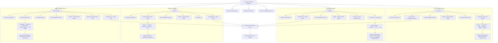

# Master Graph — English

```mermaid
flowchart TD
  ROOT[LLM Agent Research Extractions] --> AIS[AI Scientist v2]
  ROOT --> SR[Self-Refine]
  ROOT --> RX[Reflexion]
  ROOT --> MP[Meta-Prompting]

  subgraph AIP[AI Scientist v2 Extraction]
    AIS --> AI_SUM[research_summary.md]
    AIS --> AI_PROMPTS[Complete prompts and schemas]
    AIS --> AI_LOGIC[Python logic/flow inventory]
    AIS --> AI_GRAPH[English + Arabic Mermaid graphs]
    AIS --> AI_DEEP[Deep dive phase matrix]
    AIS --> AI_AUDIT[Gap audit and completeness review]
    AI_PROMPTS --> AI_PHASES[Ideation → Experiments → Plots → Citations → Writeup → Review]
    AI_PHASES --> AI_LOOPS[Stage loops, BFTS node loops, citation loops, reflection loops]
  end

  subgraph SRP[Self-Refine Extraction]
    SR --> SR_SUM[research_summary.md]
    SR --> SR_PROMPTS[Prompt files + raw prompts]
    SR --> SR_LOGIC[Python logic/flow inventory]
    SR --> SR_GRAPH[English + Arabic Mermaid graphs]
    SR --> SR_DEEP[Task matrix + paper appendix notes]
    SR --> SR_AUDIT[Completeness + quality review]
    SR_PROMPTS --> SR_PHASES[Initial generation → Feedback → Refine → Stop]
    SR_PHASES --> SR_TASKS[Acronym, CommonGen, GSM, PIE, ResponseGen, Sentiment, Readability, Visual GPT-4V]
  end

  subgraph RXP[Reflexion Extraction]
    RX --> RX_SUM[research_summary.md]
    RX --> RX_PROMPTS[Prompt/config/few-shot sources]
    RX --> RX_LOGIC[Python logic/flow inventory]
    RX --> RX_GRAPH[English + Arabic Mermaid graphs]
    RX --> RX_DEEP[Task matrix]
    RX --> RX_AUDIT[Completeness + quality review]
    RX_PROMPTS --> RX_PHASES[Attempt → Feedback → Reflection → Memory → Retry]
    RX_PHASES --> RX_TASKS[AlfWorld, WebShop, HotPotQA, Programming]
  end


  subgraph MPP[Meta-Prompting Extraction]
    MP --> MP_SUM[research_summary.md]
    MP --> MP_PROMPTS[Prompt/config sources]
    MP --> MP_DATA[Raw data samples]
    MP --> MP_LOGIC[Python logic/flow inventory]
    MP --> MP_GRAPH[English + Arabic Mermaid graphs]
    MP --> MP_DEEP[Meta/expert dispatch deep dive]
    MP --> MP_AUDIT[Completeness + quality review]
    MP_PROMPTS --> MP_PHASES[Meta Model → Expert call → Expert output → Feedback append → Final answer]
    MP_PHASES --> MP_TASKS[Game of 24, Checkmate, BBH, MGSM, P3, Sonnet, Word Sorting]
  end

  ROOT --> ARCH[archives ZIP deliverables]
  ROOT --> INDEX[PROJECT_INDEX.md]
  ROOT --> STANDARD[QUALITY_STANDARD_AR.md]

  AI_AUDIT --> FINAL[Unified final completeness status]
  SR_AUDIT --> FINAL
  RX_AUDIT --> FINAL
  MP_AUDIT --> FINAL
  FINAL --> PUBLIC[All repositories public on GitHub]

```
