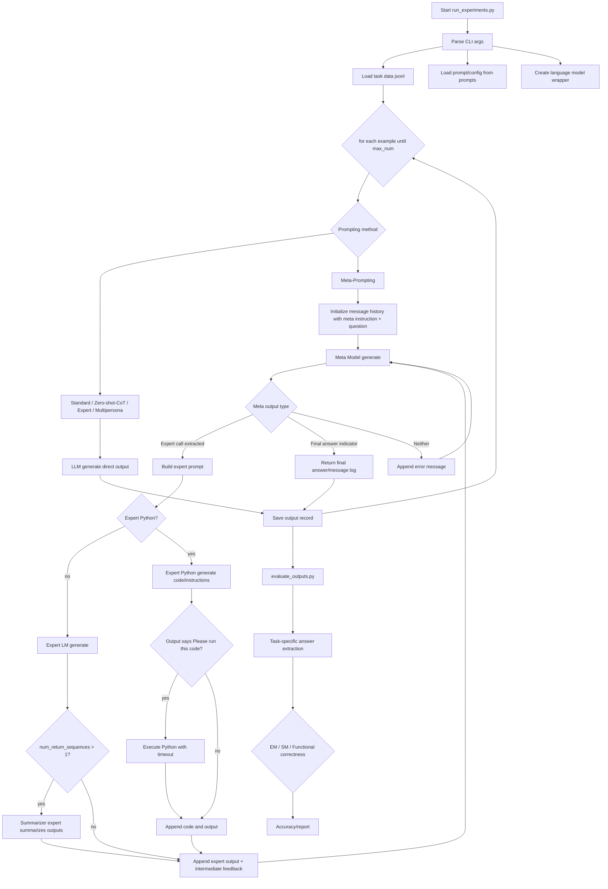

# Meta-Prompting Full System Graph — English

```mermaid
flowchart TD
  A[Start run_experiments.py] --> CLI[Parse CLI args]
  CLI --> DATA[Load task data jsonl]
  CLI --> PROMPT[Load prompt/config from prompts]
  CLI --> LM[Create language model wrapper]
  DATA --> LOOP{for each example until max_num}
  LOOP --> METHOD{Prompting method}
  METHOD --> STD[Standard / Zero-shot-CoT / Expert / Multipersona]
  METHOD --> META[Meta-Prompting]
  STD --> GEN[LLM generate direct output]
  GEN --> SAVE[Save output record]
  META --> INIT[Initialize message history with meta instruction + question]
  INIT --> MCALL[Meta Model generate]
  MCALL --> DECIDE{Meta output type}
  DECIDE -->|Expert call extracted| EXPERT[Build expert prompt]
  DECIDE -->|Final answer indicator| FINAL[Return final answer/message log]
  DECIDE -->|Neither| ERR[Append error message]
  ERR --> MCALL
  EXPERT --> ENAME{Expert Python?}
  ENAME -->|no| EGEN[Expert LM generate]
  ENAME -->|yes| EPY[Expert Python generate code/instructions]
  EPY --> RUNCODE{Output says Please run this code?}
  RUNCODE -->|yes| EXEC[Execute Python with timeout]
  EXEC --> APPENDPY[Append code and output]
  RUNCODE -->|no| APPENDPY
  EGEN --> SUMM{num_return_sequences > 1?}
  SUMM -->|yes| SUMMARIZE[Summarizer expert summarizes outputs]
  SUMM -->|no| MID[Append expert output + intermediate feedback]
  SUMMARIZE --> MID
  APPENDPY --> MID
  MID --> MCALL
  FINAL --> SAVE
  SAVE --> LOOP
  SAVE --> EVAL[evaluate_outputs.py]
  EVAL --> EXTRACT[Task-specific answer extraction]
  EXTRACT --> METRIC{EM / SM / Functional correctness}
  METRIC --> REPORT[Accuracy/report]

```
