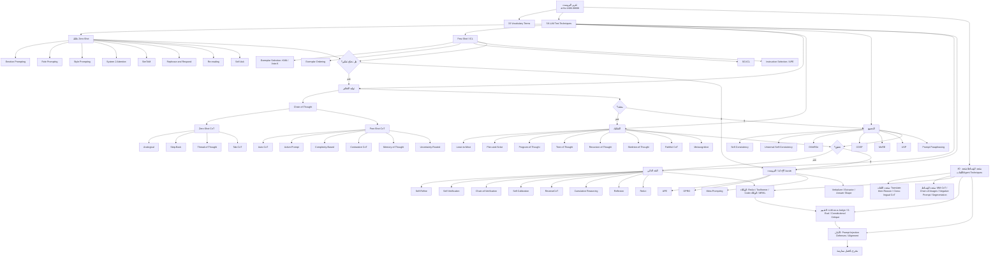

# تقرير البرومبت — الرسم التصنيفي العربي

```mermaid
flowchart TD
  PR[تقرير البرومبت
arXiv:2406.06608] --> VOCAB[33 Vocabulary Terms]
  PR --> TAX[58 LLM Text Techniques]
  PR --> MM[40 متعدد الوسائط/متعدد اللغات/Agent Techniques]

  TAX --> ZSHOT[عائلة Zero-Shot]
  ZSHOT --> EMO[Emotion Prompting]
  ZSHOT --> ROLE[Role Prompting]
  ZSHOT --> STYLE[Style Prompting]
  ZSHOT --> S2A[System 2 Attention]
  ZSHOT --> SIMTOM[SimToM]
  ZSHOT --> RAR[Rephrase and Respond]
  ZSHOT --> RE2[Re-reading]
  ZSHOT --> SASK[Self-Ask]

  TAX --> FSHOT[Few-Shot / ICL]
  FSHOT --> EXSEL[Exemplar Selection: KNN / Vote-K]
  FSHOT --> EXORD[Exemplar Ordering]
  FSHOT --> EXGEN[SG-ICL]
  FSHOT --> INSTSEL[Instruction Selection / APE]

  TAX --> THOUGHT[توليد التفكير]
  THOUGHT --> COT[Chain-of-Thought]
  COT --> ZCOT[Zero-Shot CoT]
  ZCOT --> ANALOG[Analogical]
  ZCOT --> STEPBACK[Step-Back]
  ZCOT --> THOT[Thread-of-Thought]
  ZCOT --> TABCOT[Tab-CoT]
  COT --> FCOT[Few-Shot CoT]
  FCOT --> AUTOCOT[Auto-CoT]
  FCOT --> ACTIVEP[Active-Prompt]
  FCOT --> COMPLEX[Complexity-Based]
  FCOT --> CONTRAST[Contrastive CoT]
  FCOT --> MOT[Memory-of-Thought]
  FCOT --> UROUTED[Uncertainty-Routed]

  TAX --> DECOMP[التفكيك]
  DECOMP --> L2M[Least-to-Most]
  DECOMP --> PLAN[Plan-and-Solve]
  DECOMP --> POT[Program-of-Thought]
  DECOMP --> TOT[Tree-of-Thought]
  DECOMP --> ROT[Recursion-of-Thought]
  DECOMP --> SKELETON[Skeleton-of-Thought]
  DECOMP --> FAITHFUL[Faithful CoT]
  DECOMP --> META[Metacognitive]

  TAX --> ENSEMBLE[التجميع]
  ENSEMBLE --> SC[Self-Consistency]
  ENSEMBLE --> USC[Universal Self-Consistency]
  ENSEMBLE --> DIVERSE[DiVeRSe]
  ENSEMBLE --> COSP[COSP]
  ENSEMBLE --> MORE[MoRE]
  ENSEMBLE --> USP[USP]
  ENSEMBLE --> PARAPHRASE[Prompt Paraphrasing]

  TAX --> CRITIC[النقد الذاتي]
  CRITIC --> SR[Self-Refine]
  CRITIC --> SVERIF[Self-Verification]
  CRITIC --> COVE[Chain-of-Verification]
  CRITIC --> SCAL[Self-Calibration]
  CRITIC --> REVERSE[ReverseCoT]
  CRITIC --> CUMUL[Cumulative Reasoning]
  CRITIC --> REFL[Reflexion]
  CRITIC --> REACT[ReAct]

  TAX --> ANSENG[هندسة الإجابة / البرومبت]
  ANSENG --> APE[APE]
  ANSENG --> OPRO[OPRO]
  ANSENG --> METAP[Meta-Prompting]
  ANSENG --> VERB[Verbalizer / Extractor / Answer Shape]

  MM --> ML[متعدد اللغات: Translate-then-Reason / Cross-lingual CoT]
  MM --> MMD[متعدد الوسائط: MM-CoT / Chain-of-Images / Negative Prompt / Segmentation]
  MM --> AGENT[الوكلاء: ReAct / Toolformer / Code الوكلاء / MRKL]
  MM --> EVAL[التقييم: LLM-as-a-Judge / G-Eval / Constitutional Critique]
  MM --> SAFE[الأمان: Prompt Injection Defenses / Alignment]

  %% Decision flow
  ZSHOT --> DEC1{هل نحتاج تفكير؟}
  FSHOT --> DEC1
  DEC1 -->|نعم| THOUGHT
  DEC1 -->|لا| ANSENG
  THOUGHT --> DEC2{معقد؟}
  DEC2 -->|نعم| DECOMP
  DEC2 -->|لا| ENSEMBLE
  DECOMP --> DEC3{تحقق؟}
  ENSEMBLE --> DEC3
  DEC3 -->|نعم| CRITIC
  DEC3 -->|لا| ANSENG
  CRITIC --> AGENT
  AGENT --> EVAL
  EVAL --> SAFE
  SAFE --> OUT[مخرج بأفضل ممارسة]
```
