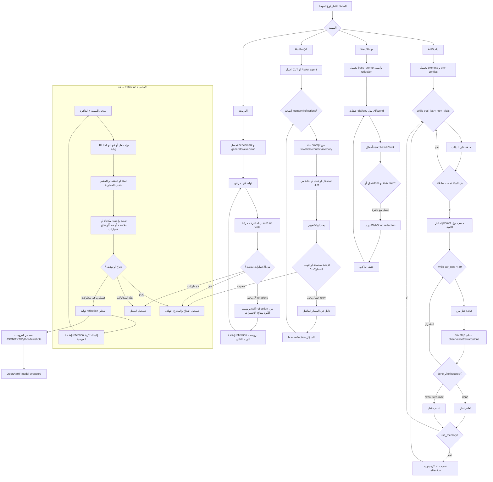

# مخطط نظام Reflexion الكامل — عربي

```mermaid
flowchart TD
  A[البداية: اختيار نوع المهمة] --> B{المهمة}
  B --> AW[AlfWorld]
  B --> WS[WebShop]
  B --> HP[HotPotQA]
  B --> PR[البرمجة]

  subgraph CORE[حلقة Reflexion الأساسية]
    X[مدخل المهمة + الذاكرة] --> ACT[الـ LLM يولد فعل أو كود أو إجابة]
    ACT --> ENV[البيئة أو المنفذ أو المقيم يشغل المحاولة]
    ENV --> FB[تغذية راجعة: مكافأة أو ملاحظة أو خطأ أو نتائج اختبارات]
    FB --> DONE{نجاح أو توقف؟}
    DONE -->|نجاح| OUT[تسجيل النجاح والمخرج النهائي]
    DONE -->|نفاد المحاولات| OUTFAIL[تسجيل الفشل]
    DONE -->|فشل وباقي محاولات| REF[توليد reflection لفظي]
    REF --> MEM[إضافة reflection إلى الذاكرة العرضية]
    MEM --> X
  end

  AW --> AW0[تحميل prompts و env configs]
  AW0 --> AWT{while trial_idx < num_trials}
  AWT --> AWE[حلقة على البيئات]
  AWE --> AWS{هل البيئة نجحت سابقًا؟}
  AWS -->|نعم| AWT
  AWS -->|لا| AWP[اختيار prompt حسب نوع اللعبة]
  AWP --> AWSTEP{while cur_step < 49}
  AWSTEP --> AWA[فعل من LLM]
  AWA --> AWO[env.step يعطي observation/reward/done]
  AWO --> AWD{done أو exhausted؟}
  AWD -->|done| AWMARK[تعليم نجاح]
  AWD -->|exhausted/max| AWFAIL[تعليم فشل]
  AWD -->|استمرار| AWSTEP
  AWFAIL --> AWREF{use_memory؟}
  AWMARK --> AWREF
  AWREF -->|نعم| AWGEN[تحديث الذاكرة بتوليد reflection]
  AWREF -->|لا| AWT
  AWGEN --> AWT

  WS --> WS0[تحميل base_prompt وأمثلة reflection]
  WS0 --> WST[حلقات trial/env مثل AlfWorld]
  WST --> WSA[أفعال search/click/think]
  WSA --> WSD{نجاح أو done أو max step؟}
  WSD -->|فشل مع ذاكرة| WSR[توليد WebShop reflection]
  WSR --> WSM[حفظ الذاكرة]
  WSM --> WST

  HP --> HP0[اختيار CoT أو ReAct agent]
  HP0 --> HPM{إضافة memory/reflections؟}
  HPM --> HPR[بناء prompt من fewshots/context/memory]
  HPR --> HPA[استدلال أو فعل أو إجابة من LLM]
  HPA --> HPE[بحث/بيئة/تقييم]
  HPE --> HPC{الإجابة صحيحة أو انتهت المحاولات؟}
  HPC -->|صحيحة| OUT
  HPC -->|خطأ وباقي retry| HPRF[تأمل في المسار الفاشل]
  HPRF --> HPMEM[حفظ reflection للسؤال]
  HPMEM --> HPM

  PR --> PR0[تحميل benchmark و generator/executor]
  PR0 --> PRG[توليد كود مرشح]
  PRG --> PRE[تشغيل اختبارات مرئية/unit tests]
  PRE --> PRP{هل الاختبارات نجحت؟}
  PRP -->|نعم| OUT
  PRP -->|لا وباقي iterations| PRR[برومبت self-reflection من الكود ونتائج الاختبارات]
  PRR --> PRM[إضافة reflection لبرومبت التوليد التالي]
  PRM --> PRG
  PRP -->|لا محاولات| OUTFAIL

  REF --> PROMPTS[مصادر البرومبت: JSON/TXT/Python/fewshots]
  PROMPTS --> LLM[OpenAI/HF model wrappers]

```
