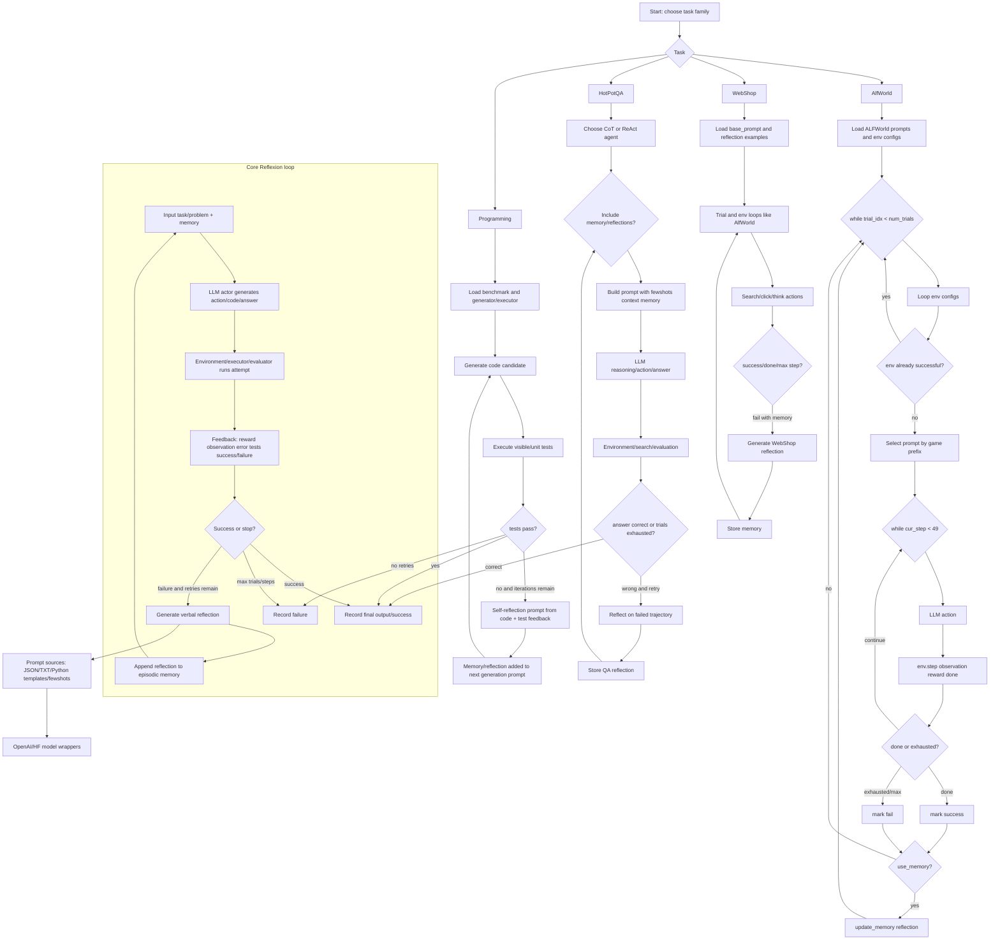

# Reflexion Full System Graph — English

```mermaid
flowchart TD
  A[Start: choose task family] --> B{Task}
  B --> AW[AlfWorld]
  B --> WS[WebShop]
  B --> HP[HotPotQA]
  B --> PR[Programming]

  subgraph CORE[Core Reflexion loop]
    X[Input task/problem + memory] --> ACT[LLM actor generates action/code/answer]
    ACT --> ENV[Environment/executor/evaluator runs attempt]
    ENV --> FB[Feedback: reward observation error tests success/failure]
    FB --> DONE{Success or stop?}
    DONE -->|success| OUT[Record final output/success]
    DONE -->|max trials/steps| OUTFAIL[Record failure]
    DONE -->|failure and retries remain| REF[Generate verbal reflection]
    REF --> MEM[Append reflection to episodic memory]
    MEM --> X
  end

  AW --> AW0[Load ALFWorld prompts and env configs]
  AW0 --> AWT{while trial_idx < num_trials}
  AWT --> AWE[Loop env configs]
  AWE --> AWS{env already successful?}
  AWS -->|yes| AWT
  AWS -->|no| AWP[Select prompt by game prefix]
  AWP --> AWSTEP{while cur_step < 49}
  AWSTEP --> AWA[LLM action]
  AWA --> AWO[env.step observation reward done]
  AWO --> AWD{done or exhausted?}
  AWD -->|done| AWMARK[mark success]
  AWD -->|exhausted/max| AWFAIL[mark fail]
  AWD -->|continue| AWSTEP
  AWFAIL --> AWREF{use_memory?}
  AWMARK --> AWREF
  AWREF -->|yes| AWGEN[update_memory reflection]
  AWREF -->|no| AWT
  AWGEN --> AWT

  WS --> WS0[Load base_prompt and reflection examples]
  WS0 --> WST[Trial and env loops like AlfWorld]
  WST --> WSA[Search/click/think actions]
  WSA --> WSD{success/done/max step?}
  WSD -->|fail with memory| WSR[Generate WebShop reflection]
  WSR --> WSM[Store memory]
  WSM --> WST

  HP --> HP0[Choose CoT or ReAct agent]
  HP0 --> HPM{Include memory/reflections?}
  HPM --> HPR[Build prompt with fewshots context memory]
  HPR --> HPA[LLM reasoning/action/answer]
  HPA --> HPE[Environment/search/evaluation]
  HPE --> HPC{answer correct or trials exhausted?}
  HPC -->|correct| OUT
  HPC -->|wrong and retry| HPRF[Reflect on failed trajectory]
  HPRF --> HPMEM[Store QA reflection]
  HPMEM --> HPM

  PR --> PR0[Load benchmark and generator/executor]
  PR0 --> PRG[Generate code candidate]
  PRG --> PRE[Execute visible/unit tests]
  PRE --> PRP{tests pass?}
  PRP -->|yes| OUT
  PRP -->|no and iterations remain| PRR[Self-reflection prompt from code + test feedback]
  PRR --> PRM[Memory/reflection added to next generation prompt]
  PRM --> PRG
  PRP -->|no retries| OUTFAIL

  REF --> PROMPTS[Prompt sources: JSON/TXT/Python templates/fewshots]
  PROMPTS --> LLM[OpenAI/HF model wrappers]

```
